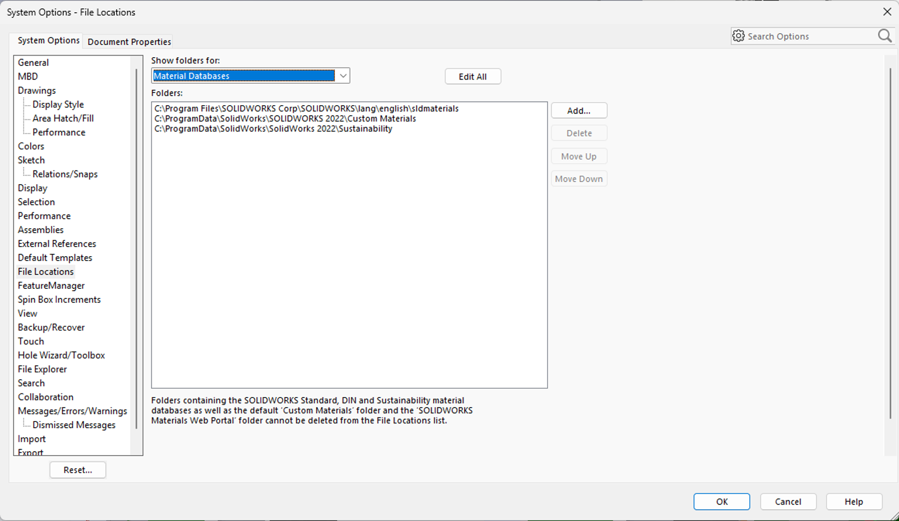
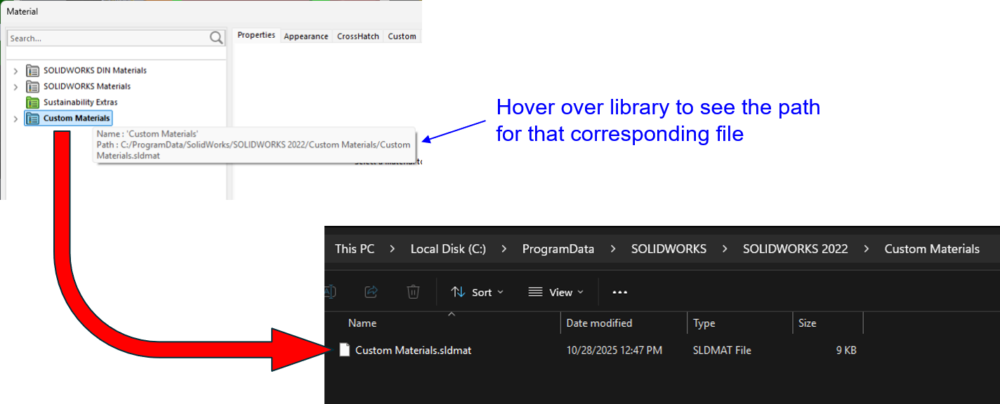
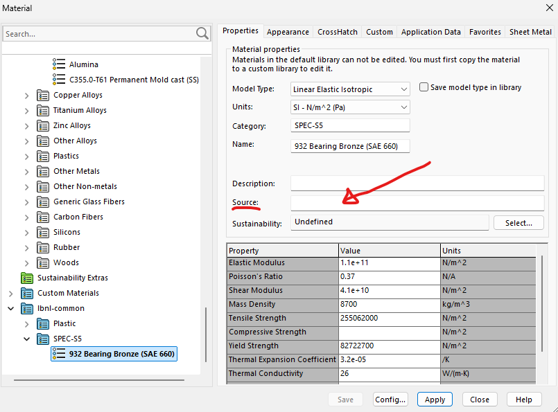

# Solidworks Materials
This repo is for sharing material definitions among [LBNL engineers](https://engineering.lbl.gov/), for use in Solidworks. Initial discussion for the sharing approach was discussed in these [slides of 2026-02-18](2026-02-18_solidworks_materials_sharing_strategy.pdf).

Contact: Joe Silber (LBNL)

## Background
Solidworks has both built-in and customizable material libraries. At LBNL we share CAD data in Windchill. Windchill support is provided for Solidworks template files, but not material library files.

As of this writing (2026-02-24) we have at least three projects in Engineering right now using Solidworks + Windchill:

- DUNE ND
- ePIC SVT
- Spec-S5

We frequently need to define custom materials that aren’t in the standard library. In the past, these material definitions have lived variously in:

- text file(s) buried on users' disks
- the particular part file where a given material is used

The goal here is to provide a reliable, practical, low-friction solution to share custom materials.

## How Solidworks stores material properties
Materials are stored in Library files on disk. These are `xml` text files but with extension `sldmat`. A single `sldmat` file can contain multiple material definitions within multiple categories.

Because the files are internally plain text, the usual git tools for diff and merge are very appropriate for selectively making internal edits within a library. 

Multiple folder locations on the user’s disk can be specified where Solidworks will look for material database files:

In the Solidworks material picker, “Libraries” correspond 1:1 to database text files on disk:

## Using properties from this repo
The simplest possible setup is like:

1. Download [`lbnl-common.sldmat`](lbnl-common.sldmat) (typically from the `main` branch) to your local disk.
2. In Solidworks, open `System Options` then go to `File Locations`. Add teh folder that contains `lbnl_common.sldmat`.

Rather than downloading the file from the GitHub web interface, you can use a command line or graphical git client (e.g. [GitHub Desktop](https://desktop.github.com/download/) on Windows or Mac, among many other options) to work in the repo like any other. Set Solidworks to scan the local repo folder on your disk.

## Adding / editing properties (local)

It's likely that most often you will add or edit materials using normal the Solidworks graphical interface. These will then be saved to your file on disk. That said, many of the properties within the `sldmat` file are quite obvious and human readable, and could be edited (if you're confident about it) directly in the plain text of `lbnl-common.sldmat`.

You can make such changes to your heart's content, locally. If you want to share them to the repo, there is an approval process (see below).

## Refreshing properties within a part

As of this writing (2026-02-24) I have not yet determined how Solidworks handles the case of an updated value in a material property file. Questions to check on include:

Does the part auto-refresh...
- with the new value upon loading in its own window?
- upon loading within a parent assembly?
- in lightweight vs resolved mode?
- never?
- only upon the user manually re-selecting the material?

Also...
- Is there any risk the old properties within a part will overwrite the vetted properties of the file on disk?

## Making changes to this repo 

Approval of changes is done by typical Git "pull requests". You can store your edits to a "branch" of your own making, but they will not be merged into the `main` branch until they've been through an approval process.

### The "pull request" sequence

1. **Create a branch** from `main`.
    - Give it a short descriptive name (e.g. `update-aluminum-density`).

2. **Make your edits** on that branch and commit them.

3. **Push the branch** to GitHub.

4. Open a **Pull Request** targeting `main`.
    - Assign a reviewer from the Reviewers panel on the right side of the PR page.

5. **Discussion happens** in the PR.
    - Reviewers can comment on specific changes.
    - You can push additional commits to address feedback.

6. **Once all conversations are resolved**, the PR can be merged into `main`.

All changes must go through this process. 

Steps (1) and (2) above can be swapped in order. I.e. if you made edits prior to creating a branch, you're still ok. Create the new branch after the fact and your uncommited changes will carry over to it.

### Change approval rules
As of this writing (2026-02-24) we have the following rules applied in GitHub which relate to approval of changes.

1. **Require a pull request before merging**
    - All commits must be made to a non-protected branch and submitted via a pull request before they can be merged.
    - We have set it to require at least 1 approval.
2. **Require conversation resolution before merging**
    - All conversations on code must be resolved before a pull request can be merged.

These rules ensure that any changes to the properties must first undergo some review by individual(s) with approval permission.

## Archiving source data
It is encouraged to post data files to the repo that justify particular material properties. These should be saved to the [`sources`](sources) folder.

The `sldmat` can include an attribute `propertysource` to state where material props come from. Within the Solidworks interface, this is the text field "Source":

## Private data
This is a publicly viewable repository. Do not post private material property data or source files.
